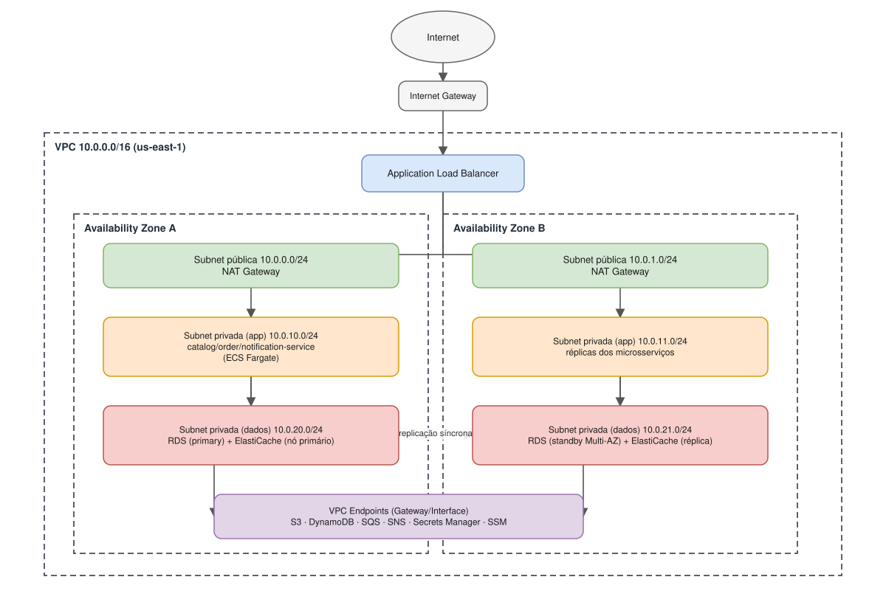

[⬅ Sumário](../README.md) · Capítulo 3 de 18

# 3. Redes: Amazon VPC

## Conceitos essenciais

- **VPC (Virtual Private Cloud)**: uma rede virtual isolada logicamente
  dentro de uma região AWS, com um bloco CIDR próprio (ex.: `10.0.0.0/16`).
- **Subnet**: uma fatia do CIDR da VPC, associada a **uma única AZ**.
  - **Subnet pública**: tem rota para um **Internet Gateway (IGW)**.
  - **Subnet privada**: não tem rota direta à internet; sai через um
    **NAT Gateway** (para atualizações/chamadas de saída) hospedado em uma
    subnet pública.
- **Route Table**: define para onde o tráfego de uma subnet é roteado.
- **Security Group (SG)**: firewall **stateful** anexado a um recurso (ex.:
  uma instância ECS ou o RDS). Se o tráfego de entrada é permitido, a
  resposta de saída é automaticamente permitida.
- **Network ACL (NACL)**: firewall **stateless** a nível de subnet — regras
  de entrada e saída são avaliadas independentemente. Serve como segunda
  camada de defesa (defesa em profundidade).
- **VPC Endpoint**: permite que recursos dentro da VPC acessem serviços AWS
  (S3, DynamoDB, SQS, SNS, Secrets Manager, SSM) **sem sair para a
  internet pública** — reduz custo de NAT Gateway e superfície de ataque.
  - *Gateway Endpoint*: gratuito, usado por S3 e DynamoDB.
  - *Interface Endpoint (PrivateLink)*: cobrado por hora + tráfego, usado
    pela maioria dos outros serviços (SQS, SNS, Secrets Manager, SSM, etc.).

## Como isso se aplica à nossa arquitetura

*(fonte editável em [`diagrams/03-rede-vpc.drawio`](diagrams/03-rede-vpc.drawio))*

Em uma implantação real na AWS, a topologia seria:

- **2 subnets públicas** (uma por AZ): apenas o Application Load Balancer e
  os NAT Gateways ficam aqui.
- **2 subnets privadas de aplicação** (uma por AZ): os três microsserviços
  Spring Boot rodam aqui (ECS Fargate ou EC2 em Auto Scaling Group) —
  nunca expostos diretamente à internet.
- **2 subnets privadas de dados** (uma por AZ): Amazon RDS (com standby
  Multi-AZ) e os nós do ElastiCache — subnets ainda mais restritas, sem
  rota nenhuma para a internet, nem mesmo via NAT.
- **VPC Endpoints** para S3, DynamoDB, SQS, SNS, Secrets Manager e SSM,
  para que o tráfego dos microsserviços para esses serviços gerenciados
  nunca saia da rede privada da AWS.

### Security Groups do case

| Security Group | Entrada permitida | Usado por |
|---|---|---|
| `sg-alb` | 443 de `0.0.0.0/0` | Load Balancer |
| `sg-app` | 8081-8083 apenas de `sg-alb` | catalog/order/notification-service |
| `sg-rds` | 5432 apenas de `sg-app` | Amazon RDS |
| `sg-redis` | 6379 apenas de `sg-app` | Amazon ElastiCache |

Esse encadeamento (ALB → app → dados), com cada SG só liberando a origem do
SG anterior, é exatamente o padrão de referência cobrado no exame para
arquiteturas em 3 camadas.

## Localmente: por que não precisamos de VPC de verdade

No `docker-compose.yml`, o Docker cria sua própria rede bridge isolada — os
containers se enxergam pelo nome do serviço (`catalog-service`, `postgres`,
`redis`, `localstack`), o que emula o isolamento de rede de uma VPC sem
precisar de nenhuma configuração AWS real. É por isso que
`order-service` chama o catálogo em `http://catalog-service:8081`
(propriedade `app.catalog-service.base-url`, ver
`order-service/src/main/resources/application.yml`) — o nome do serviço
Docker faz o papel de DNS interno da VPC.

## Para o exame

- Uma subnet é **sempre** de uma única AZ; uma VPC pode abranger várias AZs.
- NAT Gateway é **pago por hora + por GB processado** — uma das causas mais
  comuns de conta AWS "surpresa" (ver [Capítulo 16](16-custos-billing-finops.md)).
- Gateway Endpoints (S3, DynamoDB) são **gratuitos**; sempre prefira-os
  quando disponíveis antes de um Interface Endpoint pago.
- Diferença clássica de prova: Security Group avalia só regras **Allow**
  (implicitamente nega o resto); NACL avalia **Allow e Deny** explícitos,
  em ordem de número de regra.

---
**Anterior:** [← 2. IAM e Cognito](02-iam-seguranca-cognito.md) | **Próximo:** [4. Computo: EC2, ECS e Lambda →](04-computo-ec2-ecs-lambda.md)
