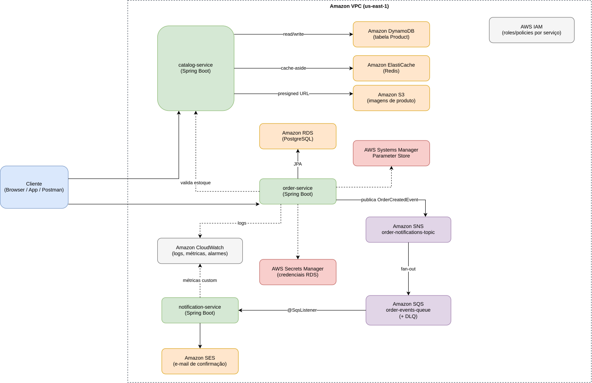
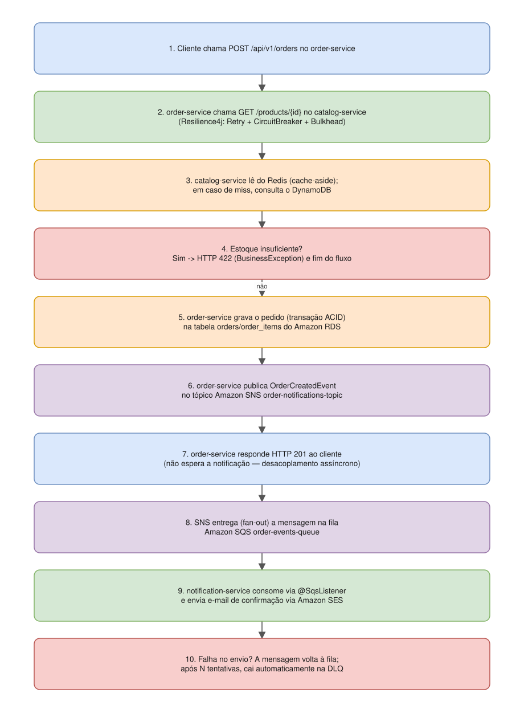

[⬅ Sumário](../README.md) · Capítulo 13 de 18

# 13. Arquitetura da Solução

## Visão geral

O e-commerce fictício é composto por três microsserviços Spring Boot,
independentes em deploy e em banco de dados, comunicando-se de forma
síncrona (HTTP, para consultas) e assíncrona (SNS/SQS, para eventos de
domínio). O diagrama completo:



*(fonte editável em [`diagrams/01-arquitetura-geral.drawio`](diagrams/01-arquitetura-geral.drawio), para abrir em [app.diagrams.net](https://app.diagrams.net))*

Resumo textual do diagrama:

```
Cliente
  │
  ├──► catalog-service ──► DynamoDB (Product)
  │         │        └───► S3 (imagens, via presigned URL)
  │         └────────────► ElastiCache/Redis (cache-aside)
  │
  └──► order-service ──► catalog-service (valida estoque, via Resilience4j)
            │      └───► RDS/PostgreSQL (orders, order_items)
            │      ├───► Secrets Manager (credenciais RDS)
            │      ├───► Parameter Store (config)
            │      └───► SNS (order-notifications-topic)
            │                   │
            │                   ▼ fan-out
            │            SQS (order-events-queue + DLQ)
            │                   │
            │                   ▼
            │        notification-service ──► SES (e-mail)
            │                   └──────────► CloudWatch (métricas)
```

## Fluxo de criação de um pedido, passo a passo



*(fonte editável em [`diagrams/02-fluxo-criacao-pedido.drawio`](diagrams/02-fluxo-criacao-pedido.drawio))*

O diagrama acima detalha os 10 passos, desde o `POST /api/v1/orders` até a
mensagem cair na DLQ em caso de falha persistente no envio do e-mail. Os
pontos-chave:

1. A validação de estoque acontece **antes** de abrir a transação de
   escrita no RDS — evita segurar uma conexão de banco esperando uma
   chamada de rede (boa prática de eficiência de recursos).
2. A resposta HTTP ao cliente **não espera** a notificação ser processada
   — o pedido é confirmado de forma síncrona (RDS), a notificação é
   **desacoplada e assíncrona** (SNS/SQS/SES). Se o SES estiver fora do
   ar por 5 minutos, o cliente nem percebe: a mensagem espera na fila.
3. Falhas no consumidor não derrubam o produtor: o `order-service`
   continua funcionando normalmente mesmo se o `notification-service`
   estiver totalmente parado — as mensagens só se acumulam na fila.

## Rede: onde cada peça rodaria na AWS real


*(fonte editável em [`diagrams/03-rede-vpc.drawio`](diagrams/03-rede-vpc.drawio))*

A VPC tem 2 AZs, subnets públicas (ALB + NAT Gateway), subnets privadas de
aplicação (os 3 microsserviços) e subnets privadas de dados (RDS +
ElastiCache) — ver detalhes no [Capítulo 3](03-redes-vpc.md).

## Por que microsserviços (e não um monólito) aqui

O objetivo didático de separar em 3 serviços é justamente poder usar **o
banco de dados certo para cada padrão de acesso** (RDS para pedidos,
DynamoDB para catálogo) e **escalar de forma independente** (o
`notification-service`, puramente assíncrono, escala pela profundidade da
fila; o `catalog-service`, de leitura intensa, escala por CPU/latência
atrás do cache). Em um monólito, essas escolhas ficariam acopladas a um
único banco e um único perfil de escala.

O trade-off (também real, e que vale saber para entrevistas): mais peças
móveis, necessidade de resiliência entre chamadas (Resilience4j, ver
[Capítulo 15](15-resiliencia-resilience4j.md)) e de observabilidade
distribuída (CloudWatch, ver [Capítulo 12](12-observabilidade-cloudwatch.md)).

## Mapa de decisões arquiteturais

| Decisão | Alternativa considerada | Por que essa escolha |
|---|---|---|
| DynamoDB para catálogo | RDS para tudo | Acesso por chave, escala automática, sem gestão de instância |
| RDS para pedidos | DynamoDB para tudo | Transação ACID multi-tabela, consultas relacionais |
| SNS + SQS (fan-out) | Chamada HTTP síncrona order→notification | Desacoplamento, resiliência a indisponibilidade do consumidor |
| URL pré-assinada S3 | Upload via proxy no catalog-service | Não gastar CPU/banda do serviço com binário |
| Redis (cache-aside) | Sem cache | Reduzir latência/custo de leitura do DynamoDB |
| Secrets Manager + Parameter Store | Variáveis de ambiente hardcoded | Auditoria, rotação, menor privilégio |

---
**Anterior:** [← 12. CloudWatch](12-observabilidade-cloudwatch.md) | **Próximo:** [14. Cloud Native e Boas Práticas →](14-cloud-native-boas-praticas.md)
